# 如何部署一个git服务而且又可以自动部署web应用呢？

- 1.docker
- 2.gogs
- 3.nginx

明白以上三者是什么，就可以开始搞事了！

## 一、放通端口，阿里云腾讯云的需要到各自的官网开放
1.查看firewall服务状态
`systemctl status firewalld`
2.查看firewall的状态
`firewall-cmd --state`
3.开启、重启、关闭firewall服务

- 开启
    `service firewalld start`
- 重启
    `service firewalld restart`
- 关闭
    `service firewalld stop`

4.查看防火墙规则
`firewall-cmd --list-all `
5.查询、开放、关闭端口

- 查询端口是否开放
    `firewall-cmd --query-port=8080/tcp`
- 开放80端口
    `firewall-cmd --permanent --add-port=80/tcp`
- 移除端口
    `firewall-cmd --permanent --remove-port=8080/tcp`
- 重启防火墙(修改配置后要重启防火墙)
    `firewall-cmd --reload`
- 参数解释
    1、firwall-cmd：是Linux提供的操作firewall的一个工具；
    2、--permanent：表示设置为持久；
    3、--add-port：标识添加的端口；

## 二、安装docker
1、使用 sudo 或 root 权限登录 Centos。

2、确保 yum 包更新到最新。

`$ sudo yum update`
3、执行 Docker 安装脚本。

`$ curl -fsSL https://get.docker.com -o get-docker.sh`
`$ sudo sh get-docker.sh`
执行这个脚本会添加 docker.repo 源并安装 Docker。

4、启动 Docker 进程。

`sudo systemctl start docker`
5、验证 docker 是否安装成功并在容器中执行一个测试的镜像。

`$ sudo docker run hello-world`
`docker ps`
到此，Docker 在 CentOS 系统的安装完成。(这部分教程来自菜鸟教程，更多系统安装请前往[菜鸟教程](http://www.runoob.com/docker/docker-tutorial.html))

## 三、用小南提供的自动脚本nan-deploy.sh去安装gogs和nginx
1、下载nan-deploy.sh
`$ curl -O http://aboutme.ink/share/nan-deploy.sh`
2、给脚本赋予权限
`$ chmod +x nan-deploy.sh`
3、运行脚本
`$ ./nan-deploy.sh /home/docker/gogs/ 10080 10022 80`
参数解释

- /home/docker/gogs/  是参数一，代表了gogs和nginx安装的路径
- 10080 是参数二，表示gogs应用访问端口，ip:10080去访问gogs首页
- 10022 是参数三，表示gogs对外暴露的ssh端口，用于配置秘钥后下载和上传git代码
- 80 是参数四，表示nginx的端口，ip直接可以访问nginx首页（80默认隐藏）

以上四个参数自己调整也可以，新手建议默认按照我的配置就可以了
以下是完整运行截图

4、打开浏览器访问ip:10080和ip:80
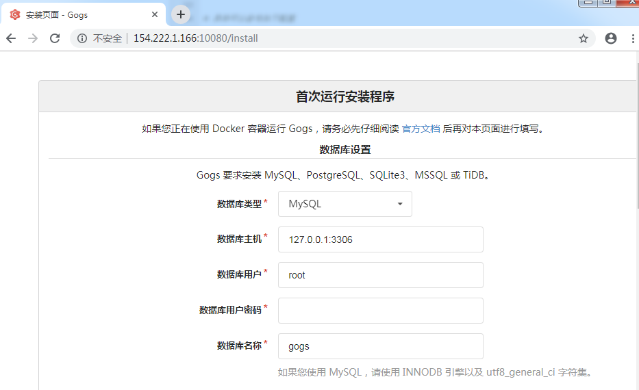

如果出现这些页面说明成功了！

5、配置gogs，打开页面ip:10080
数据库选SQLite3，域名写自己的服务器ip，ssh端口填参数三10022，勾选内置服务器，http端口填写参数二10080，应用url填写ip:10080，然后点立即安装
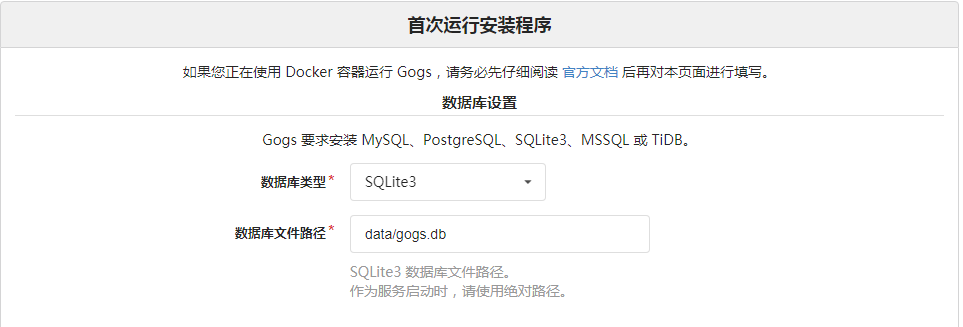
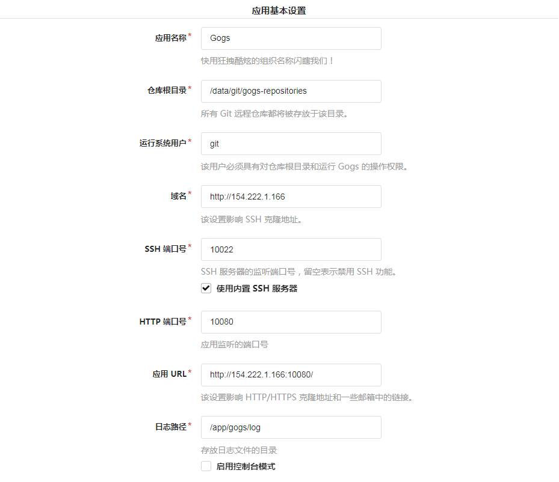

点击立即安装，稍等一会会跳转登陆页面，如下
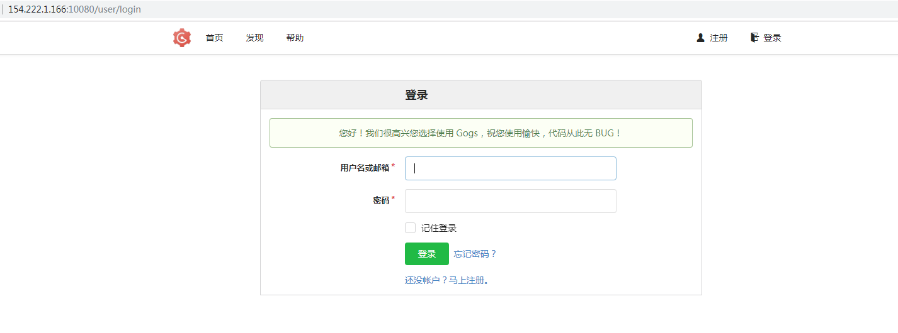
6、然后注册一个账号并且登陆会成为管理员（第一个账号）
7、新建一个仓库，并且克隆到本地
8、点击仓库设置配置git钩子或者web钩子
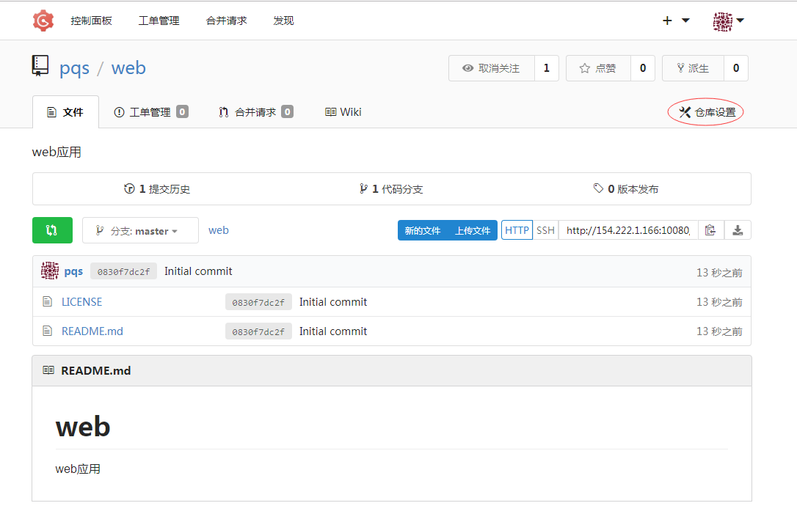
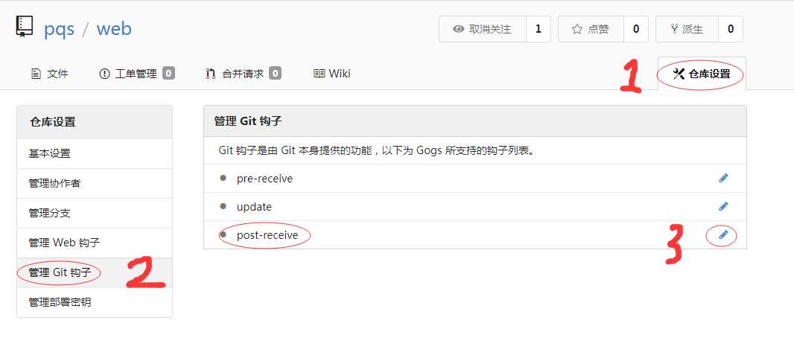
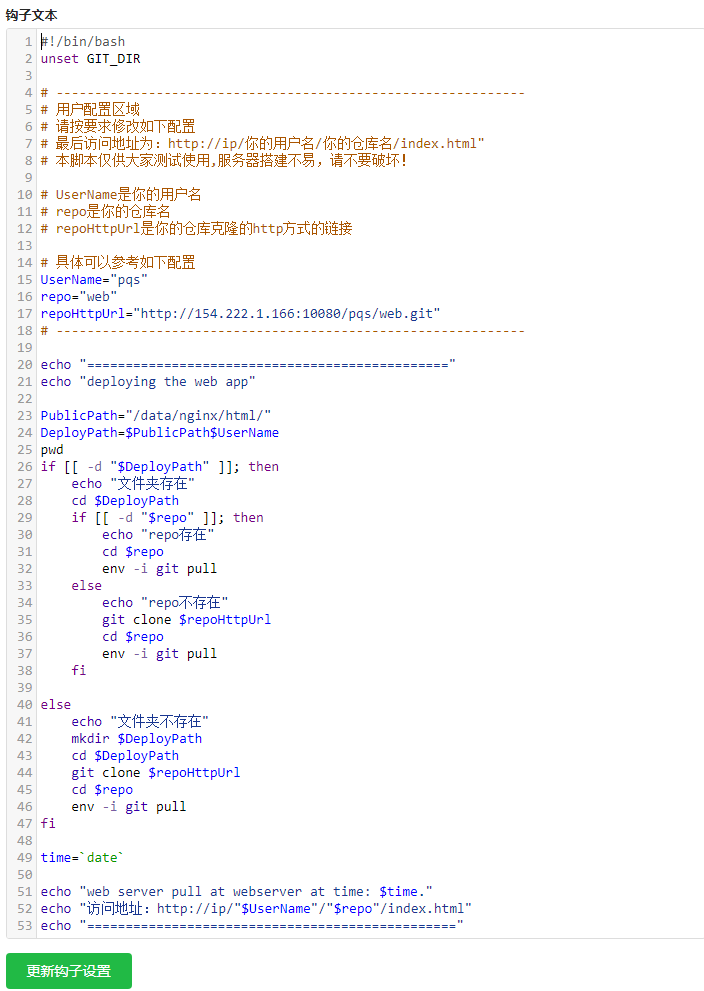
以上配置只需要修改UserName、repo和repoHttpUrl就行，然后点更新钩子设置
9、克隆你的仓库到本地并且添加一个index.txt文件并写入内容
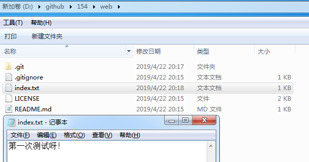
10、更新你的本地仓库后，推送到远程仓库
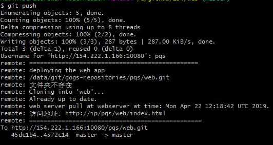
如果会显示上图的信息，说明你的钩子设置成功，并且代码已经推送到了nginx服务器上
11、打开你的浏览器测试一下

可以看到，已经可以访问了
12、再次更新你的本地仓库
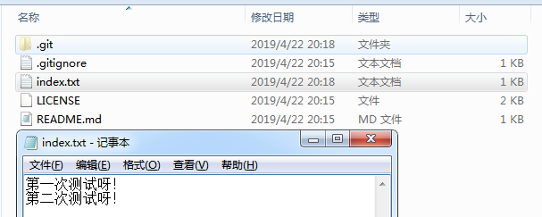
13、推送到远程仓库
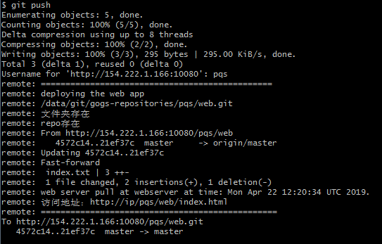
14、再次打开浏览器访问

## 小南有话说
1.其实我利用的原理就是git本身有钩子的一个功能特点，结合docker下的gogs和nginx开发了一套容易理解又非常高效的web应用自动部署平台
2.gogs还支持webhooks的web钩子进行代码的部署，这边我就没有多做讲解了，如果你学会了git钩子部署，那么web钩子部署也不是难事
