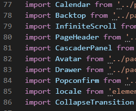
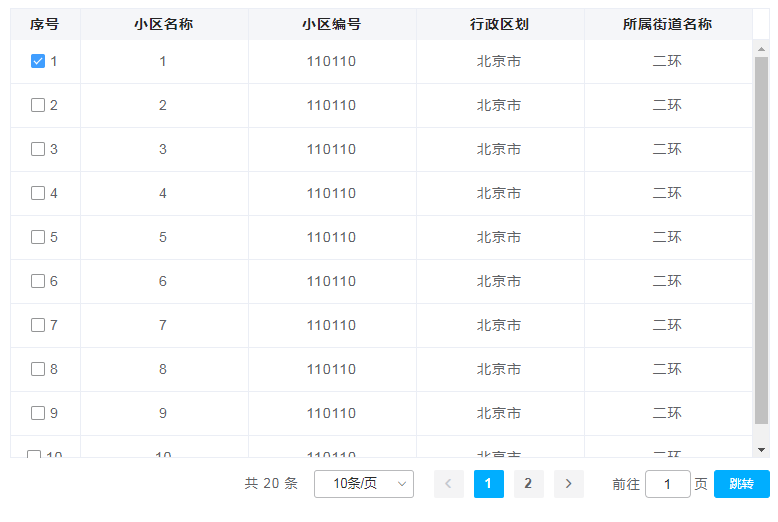
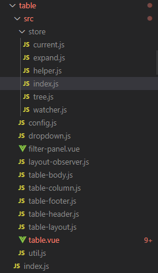
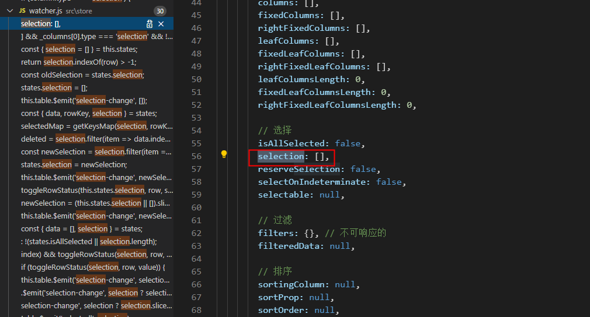
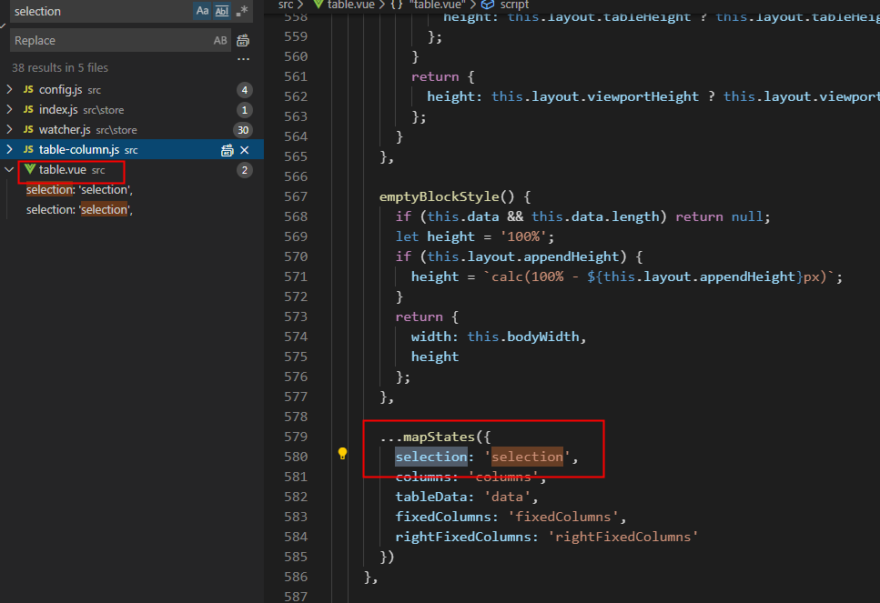
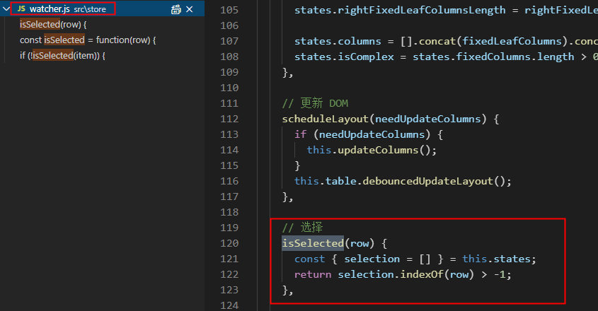
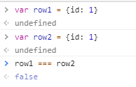

# 解读element-ui中table组件部分源码与需求分析

## 一、前言

> element-ui开源至今已成为前端在[中后台系统](https://juejin.im/post/5e0aadd26fb9a016050b8b52#heading-2)中最为热门的ui框架了。

如果说Vue、React、Angular是前端三剑客，那么element-ui可以说在中后台领域占据半壁江山，github star数 43k之多。至今，它拥有了84个组件（Version 2.13.0）。



> 前两行是空的，从第2行开始。

## 二、起因

需求：因公司业务需要，经常有页面中的表格需要多选（勾选），然后把勾选到的id组装拼成字符串提交到后台。

解决方案：在element-ui官网看文档，能够在**table**组件找到实现**多选表格**的办法，在**table**组件中加一个**type**为**selection**的列就行了。
```html
<el-table
    ref="multipleTable"
    :data="tableData"
    tooltip-effect="dark"
    style="width: 100%"
    @selection-change="handleSelectionChange">
    <el-table-column
      type="selection"
      width="55">
    </el-table-column>
</el-table>
```
配合**selection-change**事件，可以获得用户选中的row组成的数组。

效果如下：


> 一切看起来都很完美，但是在实际运用中状况是千奇百出。

为什么这么说？因为在公司的实际业务中，表格是分页表格，每次切换页码，数据重新获取，表格重新渲染，那么第一个问题来了：**用户在页码为1的表格选中的行，在切换页码之后，不见了。**

分页表格应该像下面这样：




于是我又去element-ui官网翻看文档，在**table**组件中找到了一个方法**toggleRowSelection**，此方法可以切换表格中具体哪一行的选中状态。


通过这个方法，我们在获取表格数据之后，马上用此方法设置之前选中过的数据，这样不就可以在用户切换的时候也把之前选中的行选中状态渲染出来了吗？

> 坑又马上来了！！

因为通过**selection-change**事件获取到了一个名为**selection**的数组，里面包含了用户选中的行的信息。我们把这个数组保存在一个变量中，用于用户切换页码之后还能看见之前选中的行，然通过**toggleRowSelection**方法设置行的选中信息。
```js
selection.forEach(row => {
    this.$refs.multipleTable.toggleRowSelection(row);
});
```
这乍一看是没有问题，但是在表格中，它居然没有勾选效果！！？

各种一度度娘，说是要在**nextTick**中去调用这个方法：

```js
this.$nextTick(() => {
    selection.forEach(row => {
        this.$refs.multipleTable.toggleRowSelection(row);
    });
});
```
嗯，没报错，打开页面一看，嗯？？怎么还是没有选中！！！

> 心里一w个草尼玛路过。。。。

在确定ref名称是否一致、selection中数据是否存在、调用方法是否触发之后，我仍旧得不到我想要的结果。

玩个串串。。。

一阵冷静过后，我决定了，打开element-ui源码看一看table组件中是如何判断选中的？

## 三、源码分析

> 仅仅是table组件部分源码。

### 3.1 结构

> 首先看下table组件的结构



结构就是这样，最外层的index.js用于导出这个table模块，里面的代码也非常简单，肯定能看懂的。

```js
// index.js
import ElTable from './src/table';

/* istanbul ignore next */
ElTable.install = function(Vue) {
  Vue.component(ElTable.name, ElTable);
};

export default ElTable;
```

然后src里面包含一个store文件夹和一些table的组件：body、column、footer、header、layout等，工具类文件util.js，配置文件config.js，and 一个dropdown（没懂）、一个layout-observer(从名字上看是监听layout的)、filter-panel(过滤用的)大概就这样。

store文件夹里面的代码就是实现了一个只用于table组件中各组件数据交换的一个私有的Vuex。


### 3.2 找到它
按照我的需求，我只需要看部分关于selection的源码。所以从布局上，我可以先从列从手，也就是**table-column.js**这文件。

可是看了下**table-column.js**里边确实是关于列的一些内容，但是从字面意思上没找到selection部分的功能的代码。

所以我暂且放弃从布局上找，我直接从方法上找：**toggleRowSelection**。在这个table文件夹中用搜索大法，直接搜关键词**toggleRowSelection**，在**src/store/watcher.js**中可以找到如下：
```js
// watcher.js 158行
toggleRowSelection(row, selected, emitChange = true) {
  const changed = toggleRowStatus(this.states.selection, row, selected);
  if (changed) {
    const newSelection = (this.states.selection || []).slice();
    // 调用 API 修改选中值，不触发 select 事件
    if (emitChange) {
      this.table.$emit('select', newSelection, row);
    }
    this.table.$emit('selection-change', newSelection);
  }
}
```
这个方法就是暴露在外部供我们调用的，里面第一行是主要信息，调用**toggleRowStatus**方法然后得到changed值，然后把这个值**emit**出去。大概是这么个过程，那么就要从**toggleRowStatus**着手了。

> 注意第一行中的 **this.states.selection**将是后续的关键。


直接搜索关键词，可以找到这个方法是外部导出引用进来的。

```js
import { getKeysMap, getRowIdentity, getColumnById, getColumnByKey, orderBy, toggleRowStatus } from '../util';
```

打开**util.js**文件，顺利的找到了以下代码：
```js
export function toggleRowStatus(statusArr, row, newVal) {
  let changed = false;
  const index = statusArr.indexOf(row);
  const included = index !== -1;

  const addRow = () => {
    statusArr.push(row);
    changed = true;
  };
  const removeRow = () => {
    statusArr.splice(index, 1);
    changed = true;
  };

  if (typeof newVal === 'boolean') {
    if (newVal && !included) {
      addRow();
    } else if (!newVal && included) {
      removeRow();
    }
  } else {
    if (included) {
      removeRow();
    } else {
      addRow();
    }
  }
  return changed;
}
```
解读起来也不是很难，方法名字面意思：切换行的状态。里面有两个方法，一个**addRow**，一个**removeRow**，都是字面意思。
主要实现功能：判断下是否是新的值（newVal），如果不存在（!included）就add，反之remove。主要是index值的获取，很简单粗暴，直接用**Array.prototype.indexOf**去判断，思考下，原因是不是在这里？

`Array.prototype.indexOf()：方法返回在数组中可以找到一个给定元素的第一个索引，如果不存在，则返回-1。`

- 坑1：如果这个元素是一个对象（Object），大家应该知道对象是引用类型，也就是说用indexOf去判断，只能判断出对象引用的地址是不是一样的，并不能判断里面的值是不是一样的。

但是，我仔细考虑了下，这里好像并不影响。具体思考下：我们初始化表格10条数据，此时table组件中用于存放选中row的数组selection这玩意一开始是空的，然后我们调用toggleRowSelection主动设置被选中的row，这些row都被放进到了table组件中的selection中了（通过这个toggleRowStatus中addRow方法）。

> 已经放进去，为什么不渲染相应的状态！！？

既然知道，table组件是通过selection存放被选中的row，那么，就搜索selection吧。


得到了78个结果，在7个文件中。得到的结果太多了，我们不想要这样的结果。

然后进一步用全匹配搜索：


得到了38个结果，在5个文件中。

缩小了一些范围，但是还是很多，也没办法了。一个一个文件找。

纯按照Vscode给我搜出来的顺序，第一个文件是**config.js**文件。


这个关键词在config.js文件中出现了4次，可以看到前面两次匹配结果是一个样式，并不是我们要的东西。

后面两次就很值得看了。

```js
// config.js 29行
// 这些选项不应该被覆盖
export const cellForced = {
  selection: {
    renderHeader: function(h, { store }) {
      return <el-checkbox
        disabled={ store.states.data && store.states.data.length === 0 }
        indeterminate={ store.states.selection.length > 0 && !this.isAllSelected }
        nativeOn-click={ this.toggleAllSelection }
        value={ this.isAllSelected } />;
    },
    renderCell: function(h, { row, column, store, $index }) {
      return <el-checkbox
        nativeOn-click={ (event) => event.stopPropagation() }
        value={ store.isSelected(row) }
        disabled={ column.selectable ? !column.selectable.call(null, row, $index) : false }
        on-input={ () => { store.commit('rowSelectedChanged', row); } } />;
    },
    sortable: false,
    resizable: false
  }
  // ...省略
}
```

只贴出有用的，从大的耳朵看，导出了一个模块叫**cellForced**，虽然我不知道什么意思。（四级没过，砸砸辉）。
但是里面两个函数我可看懂了，看到了**render**关键词，这不就是渲染的意思嘛，再往里一看，妈呀，幸福！！里面居然有**el-checkbox**这个组件，这不就是多选模式下那一列吗？（除此之外在table中别的地方不可能放玩意!）。

> 其实只有第四个关键词出现的位置，在第34行才是我们想要的selection这玩意。

`indeterminate={ store.states.selection.length > 0 && !this.isAllSelected }`

分析一下： store.states.selection:  我才是里面装有被选中row的数组集合。

其实接着看搜索结果第三个文件：watcher.js中，很明显能找到它：



并且在第五个文件：table.vue中使用了mapStates去映射selection，也可以找到它的影子：




然后这两个文件不用管了，因为我们找到了布局的位置，回到config.js中：

```js
// config.js 29行
// 这些选项不应该被覆盖
export const cellForced = {
  selection: {
    renderHeader: function(h, { store }) {
      return <el-checkbox
        disabled={ store.states.data && store.states.data.length === 0 }
        indeterminate={ store.states.selection.length > 0 && !this.isAllSelected }
        nativeOn-click={ this.toggleAllSelection }
        value={ this.isAllSelected } />;
    },
    renderCell: function(h, { row, column, store, $index }) {
      return <el-checkbox
        nativeOn-click={ (event) => event.stopPropagation() }
        value={ store.isSelected(row) }
        disabled={ column.selectable ? !column.selectable.call(null, row, $index) : false }
        on-input={ () => { store.commit('rowSelectedChanged', row); } } />;
    },
    sortable: false,
    resizable: false
  }
  // ...省略
}
```

一共使用了两个渲染函数，一个渲染头部，一个渲染格子，通过el-checkbox组件的属性值我们可以判断出在41行中：

```js
value={ store.isSelected(row) }
```

这一行才是渲染选中与否的关键所在。里面逻辑简单，就调用了一个方法名叫：**isSelected**，还告诉了我们是**store**中的方法。

ok，找到store文件夹，搜索一下**isSelected**关键词，在watcher.js中，我们找到了它：



```js
// watcher.js 120行
// 选择
isSelected(row) {
  const { selection = [] } = this.states;
  return selection.indexOf(row) > -1;
},
```

里边的逻辑更是简单的一匹，取出selection这个存有选中row的数组，然后返回row在selection中的位置是否大于-1。联系渲染函数中的内容，返回值为true就渲染选中，反之不选中；

- 坑2: 又是用的**indexOf**判断一个对象是否在数组中。

这里十分的致命，为什么这么说？

因为**selection**中确实存放了通过**toggleRowSelection**设置进来的row。但是在**isSelected**中**形参row**是从**table组件**中的**props**中的**data**传递过来的。

**data**又是重新请求接口获得的，所以在data中的row和selection中存放的row，它不是一个row。

这句话听上去怎么这么绕，回到最基础的，row是一个对象，它是一个引用类型，只要引用的地址不一样，那么你就不是你了。

虽然在数据结构和内容上，这两个row都一样，假设都是以下的玩意：

```js
const row1 = { name: '1', id: 0, code: 110110, area: '北京市', street: '二环' }
const row2 = { name: '1', id: 0, code: 110110, area: '北京市', street: '二环' }
```
row1和row2他喵的不相等。



但是根据我们的实际业务，row1和row2结构一样，id一样，这两个玩意就是一个东西。

举个更实际的例子：你二舅在村里的瓦房里出来，你认出来了是你二舅；你在北京东二环的某个小区里看见你二舅从某个单元出来，你二舅他喵的不是你的二舅了。这太扯了！！

所以，意思就是说在table组件中源码渲染的时候的判断，太简单了，没有更深的判断，只比较引用地址是否相同。

找到问题的根本所在，解决起来也是相当的容易。

## 四、解决方案

- 1.等element-ui更新，有人解决，提issue。
- 2.将保存在变量中的row和当前得到的table的data中的row进行深度比对，得到选中的row在当前tableData中的位置，然后将使用toggleRowSelection(tableData[index])的形式，确保你二舅是你二舅。
- 3.自行封装多选表格组件，不用自带的selection，而是通过自己实现这个功能（可以参考评论区**shaonialife**童鞋的方法，非常棒）。
- 4.改写Array.prototype.indexOf方法，使内部判断逻辑在对象的时候进行深度比对。
- 5.通过设置el-table中的row-key为id，然后设置type="selection"的那一列的reserve-selection为true，这样在你切换页码的时候，之前的页码选中的值会被保留（由评论区的 **晗__** 小伙伴提出，感谢）。但是还是要注意一点，如果需要默认勾选，依旧要判断默认勾选的那几个row在数据源tableData中的位置，然后通过toggleRowSelection设置进去。
> 以上办法，1,2,3,4我都实现了，根据具体业务需求而变化。


深度比对，我也只是实现了一层。我的思路，首先对比key值数量，然后判断你二舅的key给你大舅，这属性是否存在，里面的值是否相等。因为我的业务数据只有一层的属性值。


### 4.1 第一种通过自己渲染一个新的el-checkbox(**shaonialife**童鞋提出)：
```html
// 通过自己渲染一个新的<el-checkbox />
<el-table-column
  :align="tableColumn.align"
  type="index"
  label="序号"
  width="70">
  <template slot-scope="scope">
    <el-checkbox :value="!!checkedRowIds[scope.row.id]" @change="(val) => { toggleRowSelection(val, scope.row) }"/>
  </template>
</el-table-column>
```
**checkedRowIds**是一个对象，里面包含了**key**为**id**的集合，就像这样：
```js
const checkedRowIds = {
    0: true,
    1: true,
    2: false
}
```
当row.id = 1时，checkedRowIds[row.id] 相当于 checkedRowIds.1 这样的形式，这个值就是true，为ture就渲染勾选状态。

然后让我们看下change事件的回调函数toggleRowSelection

```js
toggleRowSelection(val, row) {
  const { checkedRowIds } = this.$props
  const { id } = row
  
  this.$set(checkedRowIds, id, val)
  
  const includes = checkedRowIds.hasOwnProperty(id)
  
  const remove = () => delete checkedRowIds[id]
  if (!val && includes) remove()
  
  const keys = Object.keys(checkedRowIds)
  const arrToString = arr => arr.join(',')
  
  const ids = arrToString(keys)
  // ids: 1,2,3
},
```
首先解构拿到checkedRowIds和row.id，然后通过**this.$set**方法把key为id，值为val的这一项设置到checkedRowIds对象集合里边。

然后判断val是否为false且checkedRowIds里边存在这个key，满足两个条件则删除这个属性。最后通过Object.keys()拿到checkedRowIds里边所有的key组成的集合，然后通过join()方法组成字符串ids。

分析一下：这个方法非常的棒，`!!checkedRowIds[scope.row.id]`这句话非常短小精悍，非常美。然后在进入页面默认勾选中非常方便，只要checkedRowIds里面有的，就会显示勾选，不用再去调用toggleRowSelection设置。

### 4.2 第二种利用row-key与reserve-selection的组合拳(晗__童鞋提出)

```html
// 利用row-key与reserve-selection的组合拳
 <el-table
  v-loading="loading"
  :data="tableData"
  row-key="id"
  @selection-change="rowChange"
>

  <el-table-column
    :reserve-selection="true"
    type="selection"
    width="55"/>
    
</el-table>
```

设置了**row-key**为id后，每一行都有一个不唯一的key值，然后通过**reserve-selection**字段保留每一次选中的结果，这样不管怎么切换页码，都可以保留之前用户选中的值。

分析一下：这个办法非常简单，而且主要是官方提供的属性，不用改变太多代码，还是不错的。但是在进入页面后，要显示默认勾选的row，就需要与tableData中的数据进行对比，然后通过toggleRowSelection方法设置。


## 五、写在后面

> 我之所以能成功 ，是因为我站在巨人的肩上。———— 牛顿

非常感谢大家的集思广益，大家在评论区的留言每一条我都仔细看，每一种方案我都会去实践，感谢大家。希望在这条路上，能够走的更远。

