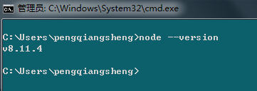
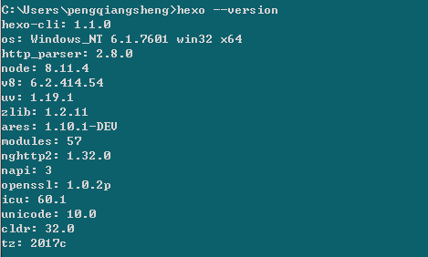
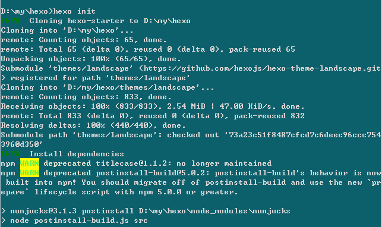
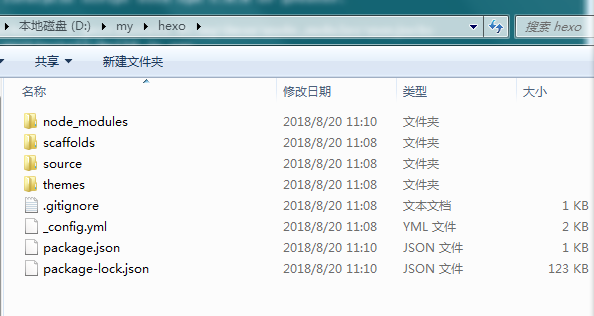
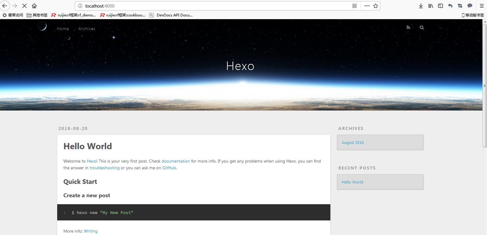
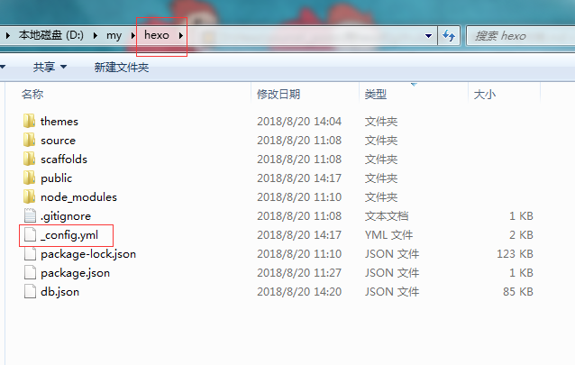
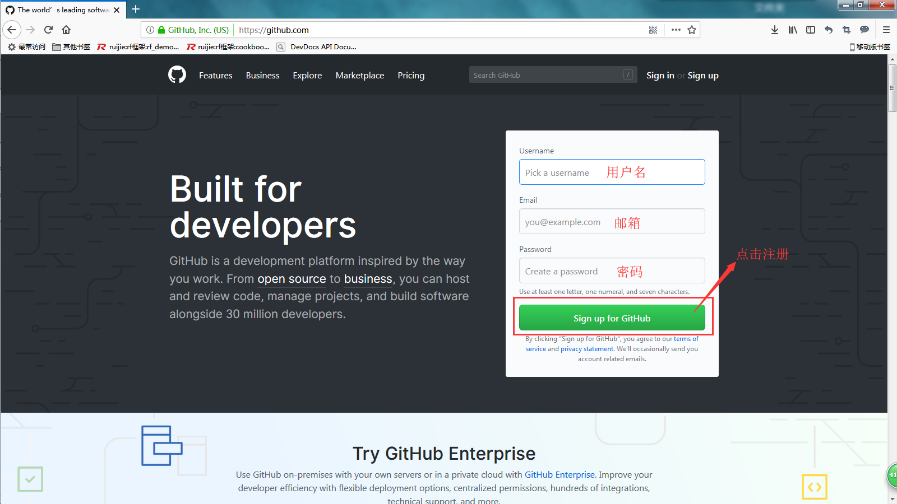
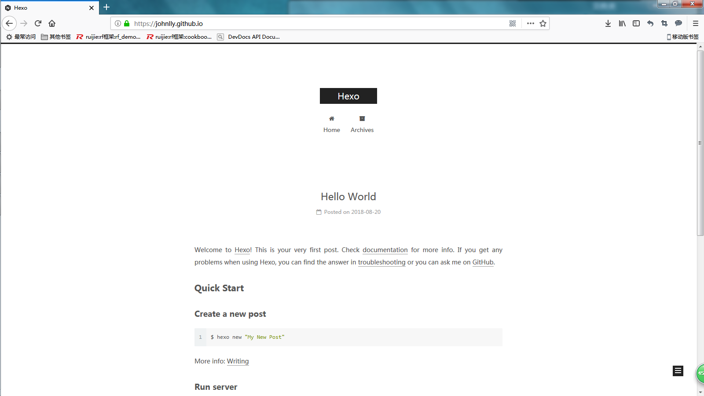

# 如何用hexo与github搭建一个属于你自己的个人博客站点呢？
***
## 一.了解hexo与github

### 1.hexo是什么？
>**[hexo](https://hexo.io/zh-cn/docs/) 是一个快速、简洁且高效的博客框架。**Hexo 使用 Markdown（或其他渲染引擎）解析文章，在几秒内，即可利用靓丽的主题生成静态网页。
### 2.github是什么？

>+ 1.**gitHub是一个面向开源及私有软件项目的托管平台**，因为只支持git 作为唯一的版本库格式进行托管，故名gitHub。
>+ 2.一个**博客网站**建立好之后，想让所有人去访问，必须要有**服务器和域名**，仅仅在你的电脑上运行是远远不够的，而服务器和域名需要购买和备案(国内)，这其中要不但要花钱还要花时间去备案，所以对于一个博客站点来说，这些代价无疑是巨大的。
>+ 3.**github是免费的**，可以把你写好的博客网站托管在github上边，通过**Github Pages**实现个人网站。
>+ 4.**Github Pages是Github免费提供给开发者的一款托管个人网站的产品**，它可以免费提供一个域名`username.github.io`去访问你的博客网站，而`username`就是你在注册github的用户名，至于更详细的内容请接着往下看。
>+ 5.我的小站：[pengqiangsheng.github.io](https://pengqiangsheng.github.io)

### 3.如何安装？
>安装hexo前，首先检查你的电脑是否安装下列应用程序：
>1.[Node.js](https://nodejs.org/en/)
>2.[Git](https://git-scm.com/)
>安装Node.js和Git之后我们可以运行使用<kbd>Win</kbd>+<kbd>R</kbd>打开运行窗口，然后输入`cmd`进入命令提示符：
>`$ node --version`
>
>如果看到上述内容说明Node.js已经安装成功了
>`$ git --version`
>
>如果看到上述内容说明git已经安装成功了
>如果出现提示“不是内部或外部命令...”请看第5点的注意事项
### 4.安装hexo
>所有必备的应用程序安装完成后，即可使用 npm 安装 Hexo
>`$ npm install -g hexo-cli`
>等待安装完成后
>`$ hexo --version`
>
>看到这些信息说明hexo安装完成
### 5.注意事项
>1.如果出现提示“node不是内部或外部命令，也不是可运行的程序或批处理文件”此类的提示可能有两个原因

>+ 环境变量 
>	百度“xxx环境变量如何添加”
>+ 管理员权限的命令提示符
>	如果环境变量添加完成后还是不行，请运行管理员权限的命令提示符

>2.关于想Node.js与Git的更深入的了解的小伙伴可以自行百度

## 二.Hexo建站

### 1.在你电脑的一个你熟悉的位置新建一个文件夹hexo
>
### 2.在命令提示符中进入这个文件夹后执行hexo init
>`$ hexo init`耐心等待一小会时间
>
>
>如果看到以上信息说明hexo init成功了，接着打开刚刚创建的文件夹，可以看到这样的目录结构：
>hexo
>|--node_modules
>|--scaffolds
>|--source(存放文章)
>|--themes(主题)
>|----.gitignore
>|----config.yml(站点配置文件)
>|----db.json
>|----package.json
>|----package-lock.json
>这里对hexo目录就不进行太多的讲解
>需要详细了解的朋友，请转到: **[文档|hexo](https://hexo.io/zh-cn/docs/)**
>
### 3.部署你的博客网站到本地进行预览
>按照顺序三步走

>+ 清除缓存文件 (db.json) 和已生成的静态文件 (public)
>`$ hexo clean`
>+ 生成静态页面至public目录
>`$ hexo generate`
>+ 开启预览访问端口（默认端口4000，'ctrl + c'关闭server)
>`$ hexo server`

### 4.打开浏览器
>访问[http://localhost:4000/](http://localhost:4000/)
>访问后，应该可以看到如下页面，说明你的博客小站搭建成功了！
>这个页面的主题是hexo官方自带主题landscape
>
### 5.主题配置
>这里呢，我推荐使用**[Next主题](http://theme-next.iissnan.com/)**

>+ 进入hexo根目录
>`$ cd your-hexo-site`
>+ 使用git clone下载Next主题到thems文件夹下
>`$ git clone https://github.com/iissnan/hexo-theme-next themes/next`

>等待下载完成后可以在hexo/themes文件夹下看到：
>
>打开hexo根目录下的config.yml文件
>
>找到字段`theme: landscape`
>把`landscape`换成`next`，然后保存
>接着按照部署到本地的方法执行这三步
>`$ hexo clean`
>`$ hexo generate`
>`$ hexo server`
>然后打开你的浏览器访问[http://localhost:4000/](http://localhost:4000/)
>你会神奇的发现主题已经换成next的简约风格
>
### 6.更多关于Next主题的内容
>请访问：**[Next使用文档](http://theme-next.iissnan.com/getting-started.html)**

## 三.在Github上托管hexo博客

### 1.注册github账号
>访问[github](https://github.com/)
>输入账号，邮箱，密码进行注册
>
### 2.新建一个项目
>
### 3.配置项目信息
>注意项目名字格式必须是:`username.github.io`
>`username`就是你注册时的用户名
>
### 4.创建好之后来到项目页面
>复制一下https的项目地址
>
### 5.上传本地hexo博客项目到github上
>有两种方式，一种是https传输，另一种是ssh秘钥传输

>+ https传输
>这种方式流程较为简单，但每次上传代码都需要输入github账号和密码
>+ ssh秘钥传输
>这种方式配置流程比较复杂，但配置完成后上传代码更为便捷
#### 5.1 https方式上传代码
>打开hexo根目录下的config.yml文件
>找到`deploy:`字段，修改如下：
```
deploy:
  type: git
  repo: https://github.com/Johnlly/johnlly.github.io.git
  branch: master
```
>repo后填的参数就是你的项目地址，然后保存
>打开命令提示符进入hexo目录
>`$ hexo deploy`既可把本地代码上传至github
>如果出现ERROR Deployer not found: git
>请先执行`npm install --save hexo-deployer-git`
>然后再`$ hexo deploy`
>执行过程中会让你输入github的账号和密码
>账号密码验证成功后提示以下信息说明上传代码成功
>
#### 5.2 ssh秘钥传输
##### 5.2.1 检查本机现有的ssh秘钥
>输入以下两条命令查看你是否有名为id_rsa和id_dsa.pub的2个文件
>如果没有转到步骤2，否则请跳到第3步
>`$ cd ~/.ssh`
>`$ ls`
##### 5.2.2 创建一个新的ssh秘钥
>`$ ssh-keygen -t rsa -C "注册Github用的邮箱"`
>输入命令后遇到需要你输入的时候，请按回车键，一共三次回车。
>现在你已经生成了一个ssh秘钥了
##### 5.2.3 将你的SSH key添加到GitHub(或者别的托管平台)
>`$ clip < ~/.ssh/id_rsa.pub`
>运行这条命令可以将秘钥的内容复制到剪切板
>然后打开github，添加ssh秘钥
>
##### 5.2.4 测试ssh秘钥是否成功添加到GitHub
>`$ ssh -T git@github.com`注意就是运行此命令
>执行过程中会有如下提示，选择yes即可
>Are you sure you want to continue connecting (yes/no)? **yes**
>你会看到如下有关成功的标志
>You've successfully authenticated, but GitHub does not provide shell access.
##### 5.2.5 用ssh方式上传代码至GitHub
>打开hexo根目录下的config.yml文件
>找到`deploy:`字段，修改如下：
```
deploy:
  type: git
  repo: git@github.com:johnlly/johnlly.github.io.git
  branch: master
```
>打开命令提示符进入hexo目录
>执行`$ hexo deploy`即可上传
#### 5.3 打开你的github项目页面
>看到如下信息,你的博客代码已经成功的托管在github上了
>
#### 5.4 打开浏览器
>输入`username.github.io`，`username`就是你的github用户名
>例如我的[https://johnlly.github.io/](https://johnlly.github.io/)可以访问到页面
>至此就大功告成了，剩下的就是主题的配置和文章的撰写了
>
#### 后续更新...