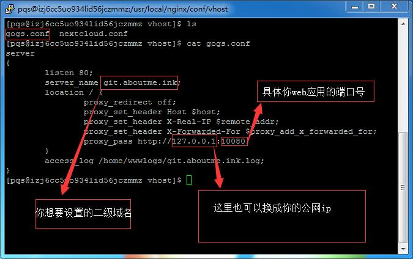

# 如何用nginx配置二级域名解析到ip的不同端口呢
总所周知，ip:80这种方式的web应用可以直接用ip去访问，原因是输入ip的时候，浏览器会自动的默认认为是ip:80这样的形式去访问。
利用这一点我们可以用域名解析到ip上进行只需要输入`www.domain.com`去访问web页面。各大网站也是如此。
## 如果是ip:80以外的端口怎么办？
一台服务器不可能说只部署一个web应用吧，其他的都要通过ip+端口或者域名+端口去访问多麻烦啊，而且样子也不好看呀。
这个时候，**救世主nginx**大爷就出现了，他说我有很多的*NB功能*啊，例如反向代理啊！

## 前提
你需要有一个域名和一台服务器（国内需备案）
然后去解析域名，添加两个A记录如下图

## Nginx方向代理
我们要如何使用这个技能呢？

- 1.首先找到你服务器中nginx的配置文件所在的文件夹
    一般都是`/usr/local/nginx/conf/`这个文件夹下有个nginx.conf或者default.conf反正.conf的文件都看一看
    命令是`cat nginx.conf`
    
- 2.然后打开nginx.conf看一眼里面的配置
    主要是找到一句话叫做`include xxxx/*.conf`,如果没有你自己加一句吧
    
- 3.然后进入这个xxxx文件夹下新建一个.conf，我这里是gogs.conf
    然后编辑gogs.conf的内容为下图，然后保存
    
- 4.记得重启nginx，如果没报错的话，你配置应该成功了

然后打开浏览器输入git.aboutme.ink试试

成功咯！

然后我再来一个cloud.aboutme.ink试试,打开浏览器访问 cloud.aboutme.ink也可以访问了


## gogs.conf的代码如下
``` 
    server
    {
            listen 80;
            server_name git.aboutme.ink;
            location / {
                    proxy_redirect off;
                    proxy_set_header Host $host;
                    proxy_set_header X-Real-IP $remote_addr;
                    proxy_set_header X-Forwarded-For $proxy_add_x_forwarded_for;
                    proxy_pass http://127.0.0.1:10080;
            }
            access_log /home/wwwlogs/git.aboutme.ink.log;
    }

```
# 后续
大家可以按照我的方法试试看，不行可以留言反馈咯，我会及时解决的。至于这两个应用怎么构建的，后续出教程啊！
