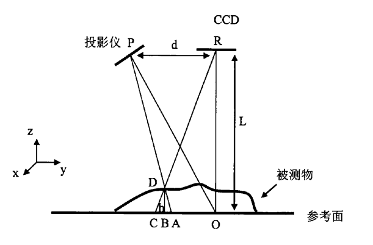

# 基于相位轮廓术的三维检测的原理

- 一般来说Phase measurement profilometry有**平行光轴法**和**交叉光轴法**两种投影方法。
- 在真实的检测系统搭建中，想要构建摄影光轴和投影光轴两者互相平行的结构比较困难。
- 所以本课题选用的是**交叉光轴法**去搭建测量系统。

## 相移法检测原理图

::: warning 注意
在系统搭建过程中需要注意的地方是相机的镜头中心和投影仪的镜头中心要保存在同一高度。
:::

### 三角形相似 <Badge text="硬核++"/>
- 图中可以显著的看出三角形DAC相似于DPR，可以列出下式：
（2-1）                  
- 从而计算出，又因为D点和C点其实是在同一条光线路径上，所以它们之间的相位差为：
（2-2）
- 求解到这一步，我们还需要知道相位信息，相位信息就隐藏在光栅信息中。
- 我们通过由matlab生成的正弦光栅条纹图投影到被测物体上，然后通过相机拍摄图片，采集到受到正弦光栅调制后的物体表面的高度分布的信息。
#### 根据光栅条纹的原理，相机采集到的光强信息可以由以下数学公式表达：

（2-3） <Badge text="核心"/>

- 其中，n=1,2,3...N-1，表示相机采集到的第N帧光栅条纹图片。
- 坐标系如上图所示方向，则表示相机实际采集到的光强分布信息，
- 表示是光栅条纹的对比度，
- 表示的是背景光强，f为光栅的空间频率，是每次光栅移动的相移， 
- 表示的是被调制后的物体表面的高度分布的相位信息，
- 因为高度信息就隐藏在该相位分布中[3]，所以我们需要将其求解出来。
- 式2-3中有，，三个未知数，
- 所以想要求解出相位值至少要列出三个方程，也就是说相移术至少要拍摄三帧光栅图像才能求解出相位信息，
- 因而相移术根据拍摄N帧光栅图像又可以称为[N步相移法](#n步相移法)。

### N步相移法 <Badge text="硬核++"/>

- 可以通过如下式子计算：
- （2-4） <Badge text="核心"/>

相应的，n取的值越小，处理的时间就越短，从而提高整体的效率。当n取值变大的时候，虽然运算的时间相对来说变长了，但是因为投影光照不均匀等因素所造成的干扰的相位误差就会减小，进而提升三维检测的精度。所以，在实际的检测过程中，按照实际情况去决定n的大小。

#### （1）三步相移法
三步相移法，很直白的描述就是n值取3，通过投影仪投射3帧图片，相应的的值取。由2-4式可以得到：
（2-5）
#### （2）四步相移法 <Badge text="use" type="warn"/>
四步相移法，简单来说就是n值取4，通过投影4帧图片，对应的为。该方法在检测速度上不逊于三步相移法，且相应的提高了准确性。

（2-6）